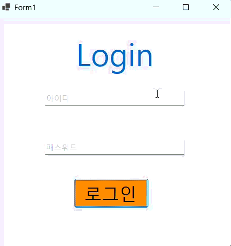
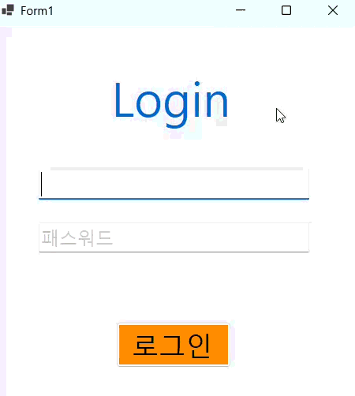
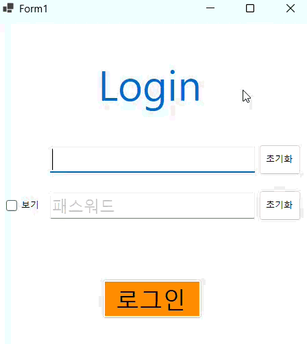

# (C# 코딩) LoginScreen
- **이름**: 김재서 (23010114)
- **학과**: 컴퓨터SW학과

---

## 개요
- C# 프로그래밍 학습
- 1줄 소개: 아이디와 비밀번호를 입력해야 하는 로그인 화면
- 사용한 플랫폼: 
	- C#, .NET Windows Forms, Visual Studio, GitHub
- 사용한 컨트롤: 
	- TextBox: 사용자 아이디 및 비밀번호 입력 (Placeholder 및 UseSystemPasswordChar 속성 제어)
	- Label: 프로그램 제목 표시 및 로그인 실패 시 인라인 에러 메시지(lblErrorMsg) 출력
	- Button: 로그인 인증 실행(btnLogin) 및 입력 필드 전체 초기화(btnClear)
	- CheckBox: 비밀번호 암호화 해제 및 시각화 제어(chkShowPW)
	- TableLayoutPanel: 창 크기 변화에 대응하는 유연한 1열 5행 그리드 레이아웃 구조

- 사용한 기술과 구현한 기능: 
	- 사용자 인증 로직: if-else 조건문과 논리 연산자(&&)를 사용하여 저장된 상수(admin, superman)와 입력값 비교 검증
	- 동적 UI 가시성 제어: Visible 속성을 활용해 메시지 박스 없이 화면 내에서 실시간 에러 피드백 제공
	- Placeholder 인터페이스: Enter 및 Leave 이벤트를 이용해 입력 가이드 텍스트와 실제 입력 데이터의 시각적 분리(Color 및 Text 제어)
	- 키보드 포커스 워크플로우: KeyDown 이벤트와 Focus(), PerformClick() 메서드를 연동하여 엔터키만으로 로그인 가능한 환경 구축

보안 및 편의 기능: UseSystemPasswordChar 속성 동적 변경을 통한 비밀번호 숨기기/보이기 토글 기능 구현
---

## 📸 단계별 실행 화면

## 실행 화면 (과제1)
- 과제1 코드의 실행 스크린샷

- 과제 내용:
	- 아이디/패스워드 인증: 지정된 아이디(admin)와 비밀번호(superman)를 입력받아 일치 여부를 판단하는 로그인 로직을 구현합니다.
	- 상황별 메시지 박스: 로그인 성공 시와 실패 시 각각 다른 메시지와 아이콘을 가진 MessageBox를 출력합니다.
	- 입력 편의성(UX) 개선: 마우스 클릭 없이 Enter 키만으로 아이디 입력창에서 비밀번호 창으로, 비밀번호 창에서 로그인 실행으로 이어지는 포커스 흐름을 제어합니다.

- 구현 내용과 기능 설명:
	- 인증 시스템: if-else 조건문과 논리 연산자(&&)를 사용하여 두 입력값이 모두 충족될 때만 접근을 허용하도록 설계하였습니다.
	- 피드백 최적화: MessageBoxButtons.OK와 MessageBoxIcon 속성을 활용하여, 성공 시에는 정보(Information) 아이콘을, 실패 시에는 오류(Error) 아이콘을 표시하여 사용자에게 명확한 상태를 전달합니다.
	- 키보드 내비게이션: txtID에서 Enter 입력 시 txtPW.Focus()를 통해 다음 입력창으로 이동시키고, txtPW에서 Enter 입력 시 btnLogin.PerformClick()을 호출하여 사용자 편의성을 극대화하였습니다.
	- 입력 오류 방지: e.SuppressKeyPress = true 설정을 통해 텍스트박스에서 Enter 키 입력 시 발생하는 윈도우 기본 비프음을 제거하여 깔끔한 사용 환경을 제공합니다.

- 사용한 기술과 구현한 기능:
	- 제어문 활용: if (id == "..." && pw == "...") 형태의 조건부 로직 구현
	- 대화 상자 제어: System.Windows.Forms.MessageBox 클래스를 이용한 동적 알림창 생성
	- 이벤트 핸들링: KeyDown 이벤트를 가로채 특정 키(Keys.Enter)에 대한 사용자 정의 동작 할당
	- 포커스 및 메서드 호출: Focus() 메서드를 통한 컨트롤 간 이동 및 PerformClick()을 이용한 이벤트 강제 발생 기술

---

## 실행 화면 (과제2)
- 과제2 코드의 실행 스크린샷

- 과제 내용:
	- 인라인 에러 메시지 구현: 로그인 실패 시 메시지 박스를 띄우는 대신, 화면 내에 배치된 Label을 통해 에러 메시지를 표시합니다.
	- 상태 기반 화면 제어: Visible 속성을 활용하여 평상시에는 메시지를 숨기고, 특정 조건(로그인 실패) 발생 시에만 메시지가 나타나도록 구현합니다.
	- UX 최적화: 사용자가 정보를 확인한 후 다시 입력을 시도할 때 에러 메시지가 자연스럽게 사라지도록 처리합니다.

- 구현 내용과 기능 설명:
	- 동적 가시성 제어: 에러 메시지용 Label(lblError)의 초기 Visible 속성을 false로 설정하여 사용자 인터페이스를 깔끔하게 유지합니다.
	- 조건별 UI 업데이트: 로그인 버튼 클릭 이벤트 내에서 인증 실패 시 lblError.Visible = true; 코드를 실행하여 사용자에게 즉각적인 경고를 제공합니다.
	- 입력 상태 동기화: 아이디나 비밀번호 입력창에 포커스가 들어오는 Enter 이벤트 발생 시 에러 메시지를 다시 숨김 처리(Visible = false)하여, 새로운 입력을 방해하지 않도록 설계하였습니다.
	- 직관적 디자인: 에러 메시지를 붉은색(ForeColor = Red)으로 설정하여 시각적으로 문제 상황임을 명확히 인지할 수 있도록 하였습니다.

- 사용한 기술과 구현한 기능:
	- 속성 제어: Control.Visible 속성을 이용한 런타임 UI 요소 표시/숨김 기술
	- 이벤트 기반 로직: Click 이벤트와 Enter 이벤트를 연동한 상태 전환 로직
	- UI 레이아웃: TableLayoutPanel 내에서 에러 메시지 공간을 확보하고 중앙 정렬하는 배치 기술
	- 텍스트 제어: 상황에 따라 Label의 Text 내용을 동적으로 변경하고 초기화하는 기능

---

## 실행 화면 (과제3)
- 과제3 코드의 실행 스크린샷

- 과제 내용:
	- 입력 편의성 극대화: 사용자가 마우스 조작을 최소화하고 키보드만으로 로그인을 완료할 수 있는 환경을 구축합니다.
	- 데이터 관리 편의성: 입력된 정보를 한꺼번에 삭제하거나, 입력 중인 비밀번호를 시각적으로 확인할 수 있는 부가 기능을 추가합니다.
	- 인터랙티브 UI 구현: 사용자의 행동(포커스 진입, 체크박스 선택 등)에 따라 실시간으로 반응하는 인터페이스를 완성합니다.

- 구현 내용과 기능 설명:
	- 키보드 내비게이션 최적화: txtID에서 Enter 입력 시 txtPW로 포커스를 이동시키고, txtPW에서 Enter 입력 시 곧바로 btnLogin이 실행되도록 설정하여 작업 속도를 개선하였습니다.
	- 입력 폼 일괄 초기화: '전체 지우기' 기능을 통해 txtID와 txtPW를 초기 Placeholder 상태로 되돌리고, 활성화되어 있던 에러 메시지(lblErrorMsg)를 즉시 숨기도록 구현하였습니다.
	- 비밀번호 가독성 제어: CheckBox의 선택 상태에 따라 UseSystemPasswordChar 속성을 동적으로 변경하여, 사용자가 필요 시 비밀번호를 일반 텍스트로 확인할 수 있도록 하였습니다.
	- 상태 기반 Placeholder: Enter와 Leave 이벤트를 통해 안내 문구("아이디", "패스워드")를 제어하며, 비밀번호 입력 시에만 시스템 보안 문자가 작동하도록 정교하게 설계하였습니다.

- 사용한 기술과 구현한 기능:
	- 이벤트 핸들링: KeyDown 이벤트를 이용한 키 입력 감지 및 CheckedChanged을 통한 체크박스 상태 추적
	- 컨트롤 메서드 활용: Clear(), Focus() 및 PerformClick()을 이용한 하드웨어 조작 시뮬레이션
	- 동적 속성 변경: UseSystemPasswordChar와 ForeColor를 이용한 실시간 UI 상태 업데이트
	- 상태 유지 로직: 변수(myID, myPW)와 입력값의 실시간 비교 및 UI 피드백 동기화

---

## 실행 화면 (과제4)
- 과제4 코드의 실행 스크린샷

- 과제 내용:
	- 

- 구현 내용과 기능 설명:
	- 

- 사용한 기술과 구현한 기능:
	- 